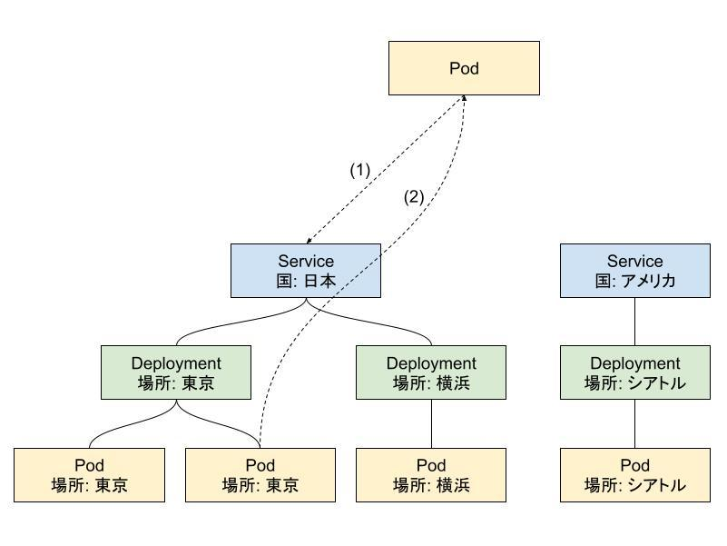

# k8spod-expressvpn-gateway

Inspired by [angelnu/pod-gateway](https://github.com/angelnu/pod-gateway).

## デフォルトの挙動

1. vxlan11298 を作成する。
2. DNS と、自身の (K8s 内での) IP アドレスを返すサーバーを起動する。
3. Client Pod のトラフィックに制限をかける。
   1. 基本的に全トラフィックを遮断する。
   2. 10.0.0.0/8 と 192.168.0.0/16 はこれまで通り疎通可能にする。
   3. Gateway Pod の (K8s 内での) IP アドレスを取得する。
   4. vxlan11298 を作成する。
4. dhclient を使って (VXLAN 内での) IP アドレスを取得・設定する。
5. Gateway Pod と疎通を定期的に確認し、途切れたら 3. に戻る。
6. グローバル行きのトラフィックは expressvpn を通る。
7. ローカル行きのトラフィックは expressvpn を通らない。

## Gateway Pod の (K8s 内での) IP アドレス

1. `curl -fs http://jp.expressvpn.cluster.local`
2. expressvpn が起動している Pod の IP アドレスが返ってくる。

Service 経由で、Deployment に所属する Pod にアクセスすると、Pod の IP アドレスが返ってくる。Service で ExpressVPN で接続する国をまとめて、Deployment で (都市などの) 場所をまとめることができる。必ずこのような構成にする必要はないが、以下のように管理がシンプルになる。

- 接続する国の追加/削除は、Service の変更で対応できる。
- 都市などの場所の追加/削除は、Deployment の変更で対応できる。
- 冗長化は、Deployment の replica 数を増やすことで対応できる。

## 設定例

`test/` を参照。`test/run.sh` を実行すると、[kind](https://github.com/kubernetes-sigs/kind) と kubectl がダウンロードされるが、`.cache/bin` にダウンロードされるので、グローバル環境が汚染されることはない (はず)。なお、実行には ExpressVPN のアクティベーションコードが必要。
